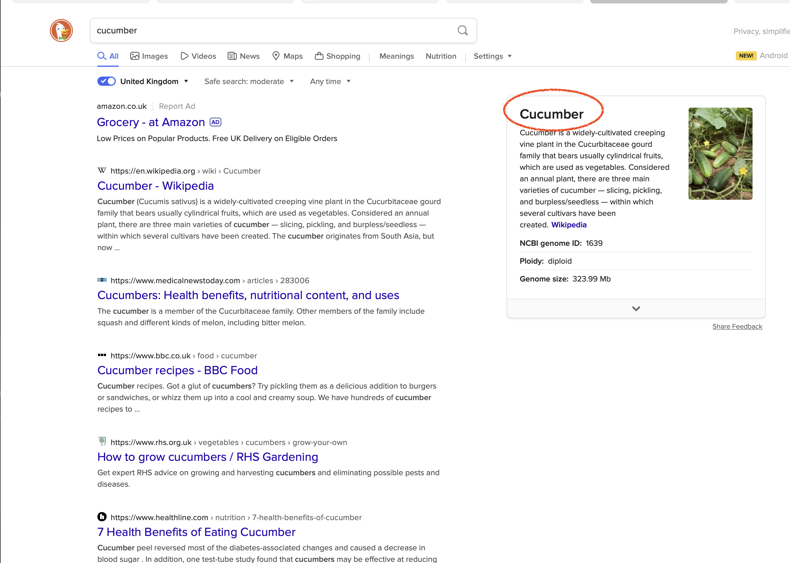

# Serenity JUnit Screenplay Starter project

Get started quickly with Serenity BDD and JUnit 5 with this simple starter project. 

## The failing test

As a duckduckgo search engine user

When I search for "cucumber"

I want to ensure that the sidebar is displayed correctly

It appears the developers made some changes and this section is no longer being found correctly:

